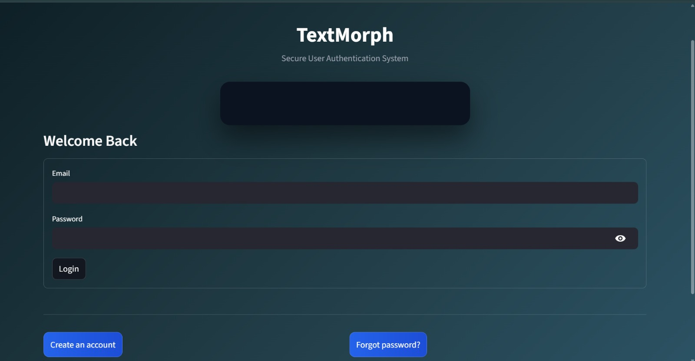
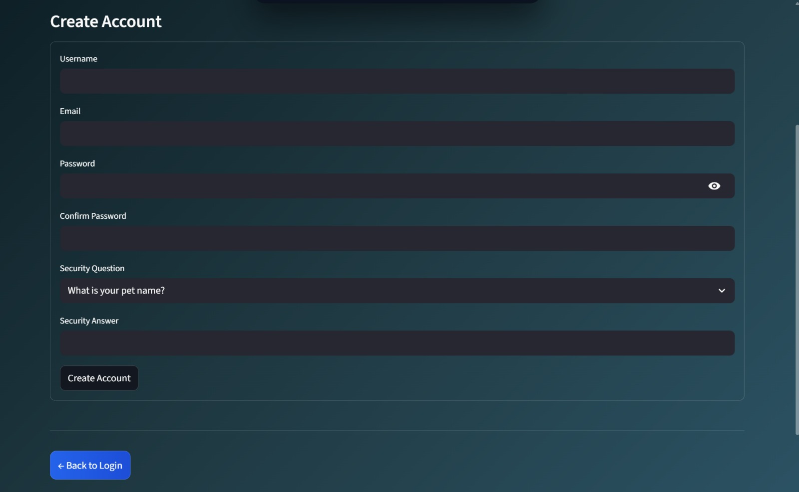
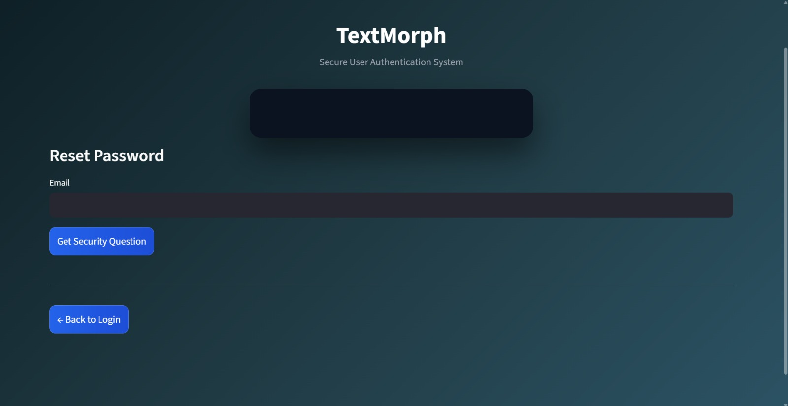

# Milestone 1 – User Authentication System (TextMorph)

## Overview
This milestone implements a secure user authentication system using Streamlit
as part of the Infosys Springboard TextMorph project.

## Technologies Used
- Python
- Streamlit
- SQLite
- bcrypt
- pyngrok

## Features Implemented
- User Signup
- Login Authentication
- Forgot Password
- Password Reset using Security Question
- Secure password hashing
- Session-based login and logout

## Screenshots

### Login Page


### Signup Page


### Forgot Password / Reset Password


## How to Run the Project
```bash
pip install streamlit pyjwt bcrypt pyngrok
streamlit run app.py
